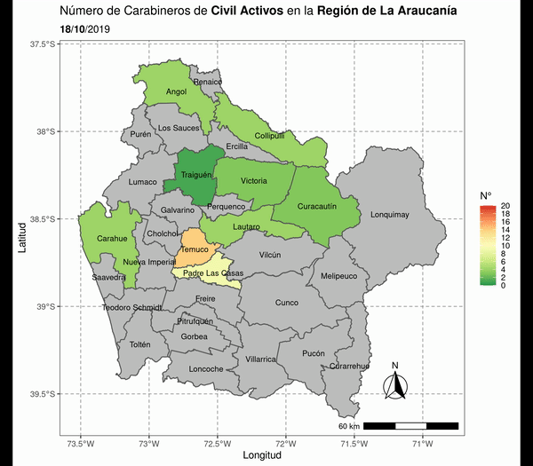

# LaPublicaMap

## Intro
This repo was created to give a hand to [LaPublica](https://lapublica.cl/) in order to visualize the chilean police forecement displacement during the [Oct 2019-2020 Protest](https://en.wikipedia.org/wiki/2019%E2%80%9320_Chilean_protests)

## How this repo works
### R code to create a story telling of the number of police in each commune 

## Main Script
> tmap_lapublic.R

## Video deployer
> gifTer.R